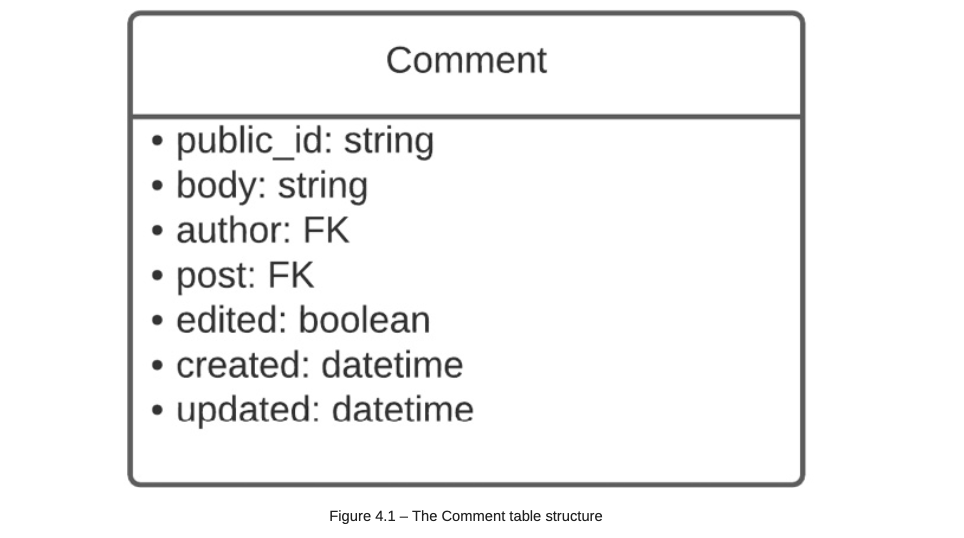

# Adding Comments to Social Media Posts

## Writing the Comment model

- a comment in context of this project represents a small text that can be viewed by anyone but only be created or updated by authenticated users.

A comment will mostly have four components:

1. author of the comment
2. post on which the comment has been made
3. body of the comment
4. edited field to track whether the comment has been edited or not

- here we can see that we have two database relationships in the table: author and post. how does this schematize in the database?

- here, the author (`User`) and post (`Post`) fields are **ForeignKey** types. some rules for the comment feature:

    1. a user can have many comments, but a comment is created by one user
    2. a post can have many comments, but a comment is linked to only one post

**Adding the Comment model**

- `core/comment/models.py/` directory:

## Writing the commment serializer