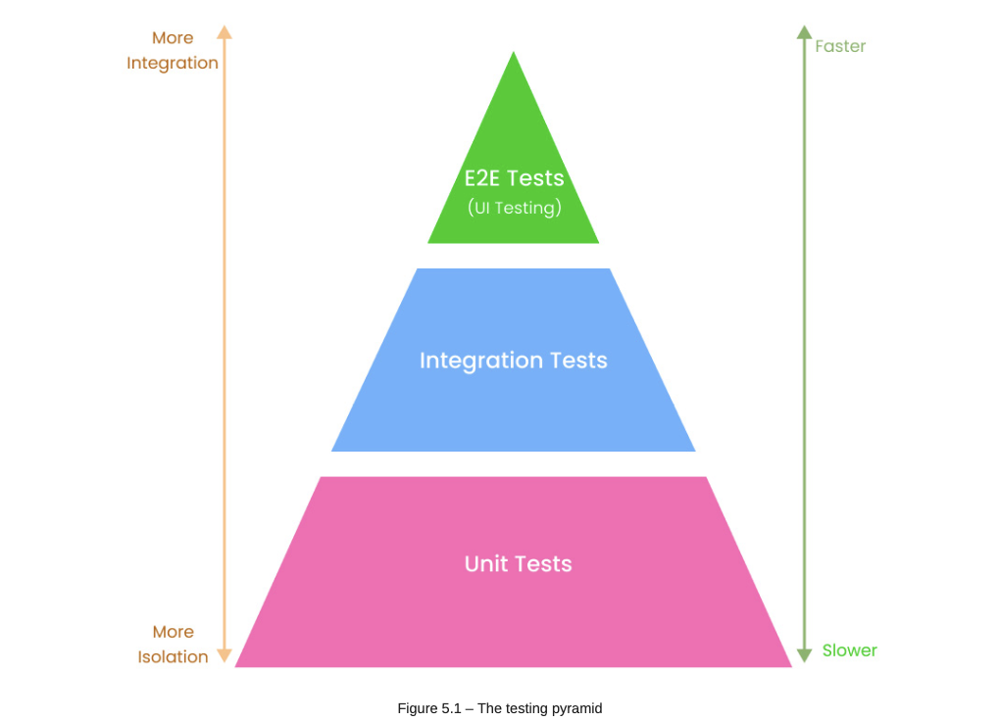

# Testing the REST API

- testing is a process of checking whether the actual software product performs as expected and is bug free.
    - aim: detect failures, including bugs and performance issues in the application.  

What is software testing?

- Software testing is the process of examining the behavior of the software under test for validation or verification.
- considers the attributes of reliabiity, scalability, reusability, and usability to evaluate the execution of the software components (servers, database, application, and so on) and find software bugs, errors, or defects.

Testing is typically classified into three categories:

- functional testing - this type of testing comprises unit, integration, user acceptance, globalization, internationalization testing etc
- non-functional testing - checks for factors such as performance, volume, scalability, usability, and load
- maintenance testing - considers regression and maintainance

## Understanding manual testing

- manual testing is the process of testing software manually to find defects or bugs. It’s the process of testing the functionalities of an application without the help of automation tools.

## Understanding automated testing

- automated testing is simply the process of testing software using automation tools to find defects. automations tools can be scripts written in the language used to buils the application or some software or drivers such as Selenium, WinRunner, and LoadRunner.

## Testing in Django

- Pytest is used, which is a framework for writing small and readable tests. in API testing is used to write code to test API endpoints, databases, and UI.

**Testing pyramid**

1. unit tests - target individual components or functionality to check whether they work as expected in isolated conditions. 
2. integration tests - test how code interacts with other code or other parts of the software. can also be a test between the application and an external service e.g., payment API.
3. end-to-end tests - ensure that the software is working as required. test how the application works from beginning to end.

**Test-Driven-Design (TDD)**

- software development practices that focus on writing unit test cases before developing the feature.
    - ensures optimized code, application of design patterns and better architecture, helps developers understand the business requirements, and makes the code flexible and easier to maintain.

## Writing tests for Django models

- alwways a good idea to start writing tests for the models in a Django project.
    - helps to make sure that methods or attributes on the model are well represented in the database.

## Writing tests for the User model

- add a new file `tests.py` inside the `core/user` directory

What is a decorator?

- it a funtion which takes another function as its argument and returns another function. `@pytest.mark.django_db` gives us access to the Django database. 