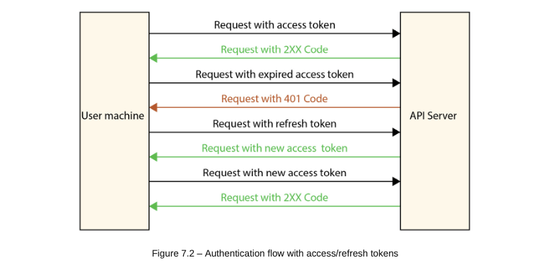

# Building Login and Registration Forms

Registration and login are essential featuees of web applications that have users. even if an auth flow can be handled directly with simple requests, there is also a need to have logic working behind the UI to manage the authentication and session, especially when using JSON web token (JWT).

## Understanding the authentication flow

- quick recap: we have a registration and a login endpoint. these endpoints return the user objects with two tokens:
    1. access token wwith a lifetime of 5 minutes - this token helps with authentication on the server side when requesting without the need to log in again. then we can access resources and perform actions on these resources.
    2. refresh token - this token helps us retrieve another access token if one has already expired.

With this data coming from the sever, we can manage auth from the React application side. when a registration or a login is successful, we store the returned response in the client's browser; use `localStorage` for this

- the `localStorage` property helps us to work with the browser storage, enabling browsers to store key-value pairs in the browser. two methods are used with `localStorage`: 
    - `setItem()` - to set a key-value pair.
    - `getItem()` - to access the values.

- then, for each request sent to the server, we add the Authorization header to the requests containing the access token retrieved from `localStorage`. NB: if the request returns a `401` error, that means the token has expired.
    - if that happens, we send a request to the refresh endpoint to get a new access token, using the refresh token also retrieved from `localStorage`. and with this access token, we resend the failed request.
    - if we receive a `401` error again, it means that the refresh token has expired. then, the user is sent to the login page to log in again, retrieve new tokens, and store them in `localStorage`

## Writing the requests service

Axious is used to send asynchronous HTTP requests to REST endpoints.

