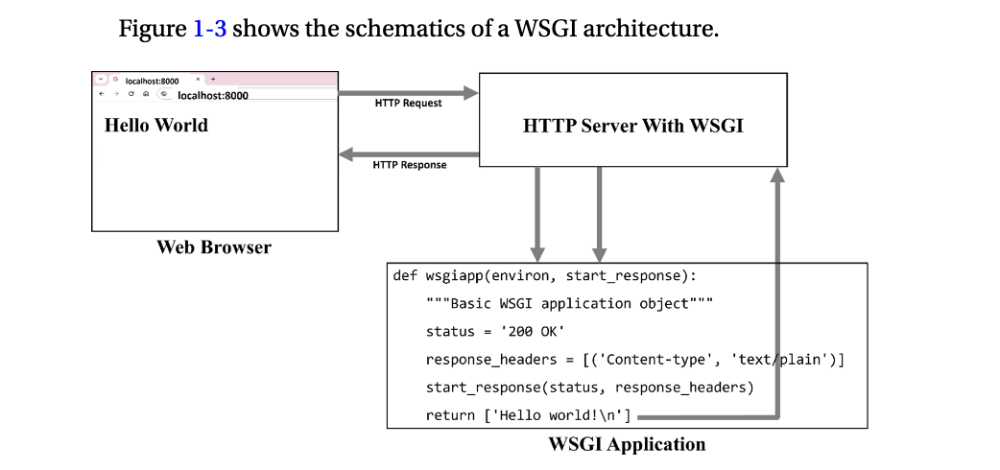
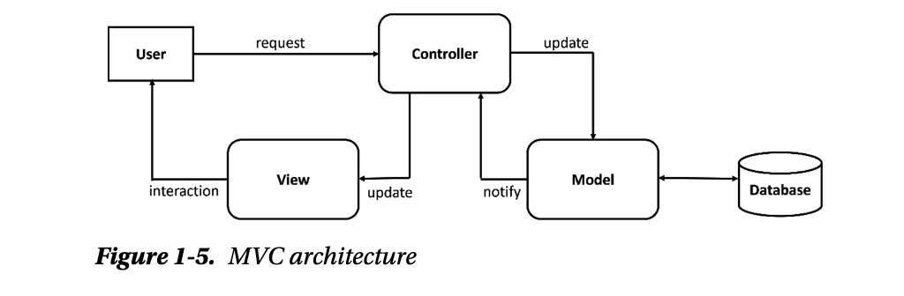
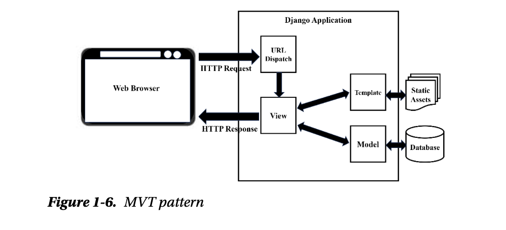

# Chapter 01 - Django Basics

## Foundations of Web Development

- let's take for example, when a user visits the URL `https://example.com/about` the question that should come into our minds as developers is what is happening in the background.

- the real process:

```text
Browser
    │
    ▼
DNS
    │
    ▼
Server
    │
    ▼
Django
    │
    ▼
Database (optional)
    │
    ▼
Django builds a Response
    │
    ▼
Browser renders HTML
```

- every Django application exists to receive an HTTP request and produce an HTTP response.
    - everything else (models, templates, authentication is built around this idea).

**What is the Web??**

- (feel like all my notes are going to be analogies lol) the way i understand how the web works is like this - i imagine owning a restaurant where customers don't just walk into the kitchen instead:
    1. place an order
    2. then the kitchen prepares it
    3. the waiter brings it back

- the web works almost identically

```text
Browser
    │
HTTP Request
    │
Server
    │
HTTP Response
    ▼
Browser
```

**What is a Client??**

- a client is a software that requests a service from another computer e.g., Chrome, Mobile apps, React frontend, Postman, curl etc
- NB: clients initiate communication

**What is a Server??**

- a server is software that waits for requests and sends responses e.g., Django, FastAPI, Express, Spring Boot.
- NB: a server doesn't "push" pages to users. it waits until someone asks.

**What is a Web Application??**

- a web application is software that users interact with through a web browser over HTTP
- unlike a static website, a web application generates content dynamically based on request, user, or data.

**Differences between static vs. dynamic websites**

- on static websites every visitor receives the same file `index.html` no database, no login, no user-specific content.
- on dynamic websites the server generates th response.

> A backend framework like Django exists to receieve HTTP requests, execute application logic, optionally interact with data sources, and return HTTP responses.

## HTTP Fundamentals

**What is a HTTP??**

it is an application layer protocol built on top of a TCP connection. 
- HTTP = Hypertext Transfer Protocol

what problem does HTTP solve? suppose we write a backend for an event management application and the frontend need to send requests for things like:

- showing all the events
- creating a new event
- updating an event
- deleting an event

how does it communicate those intentions???

- needs a **standard language** that every browser and server understand. the standard is HTTP (HyperText Transfer Protocol). 
- we can think of HTTP as the language spoken between the client and the server.

every HTTP communication has two parts:

```text
Client -----------------------> Server
          HTTP Request

Client <----------------------- Server
          HTTP Response
```

**What is inside a Request??**

- an HTTP request has four major parts

1. **Method**

- tells the server **what action** the client wants

| Method | Meaning | Example |
| ---    | ---     | ---     |
| GET    | Read data | View products |
| POST   | Create new data | Create account |
| PUT    | Replace data | Replace profile |
| PATCH  | Partially update | Change username |
| DELETE | Remove data | Delete account

2. **URL**

- e.g., https://example.com/products/15

    - `https://` - is the protocol
    - `example.com` - domain
    - `/products/15` - path

> Django's URL dispatcher decides which view handles that path.

3. **Headers**

- headers contain metadata e.g., 

```text
Content-Type: application/json

Authorization: Bearer <token>

Accept: application/json
```

- NB: headers are not the actual data. they are _information about the request_.

4. **Body**

- the body contains the actual data being sent for example creating a user:

```JSON
{
    "name": "John Doe",
    "email": "john.doe@example.com"
}
```

> GET requests usually do not have a body. POST requests usually do.

After processing the request, the server sends back a response which contains four parts:

- status code

| Code | Meaning |
| ---  | ---     |
| 200  | Success | 
| 201  | Created successfully |
| 204  | Success with no content |
| 400  | Bad request |
| 401  | Not authenticated |
| 403  | Forbidden |
| 404  | Not found |
| 500  | Internal server error |

- response headers (describe the response)

```text
Content-Type: application/json

Content-Length: 156
```

- response body

```JSON
{
    "message": "Success"
}
```

### Example Scenario

- when we press the Login button, the browser sends a request to the `/login` endpoint with a POST method and user's credentials (email & password).
- the server then checks the credentials and if correct:

```json
200 OK

{
    "access_token": "...",
    "user": {...}
}
```

- if incorrect:

```json
401 Unauthorized

{
    "detail": "Invalid credentials"
}
```

Django's lifecycle:

```text
Browser
      │
HTTP Request
      │
Web Server (Gunicorn/Uvicorn)
      │
Django
      │
URL Router
      │
View
      │
(Optional) Database
      │
HttpResponse
      │
Browser
```

> HTTP is a stateless protocol i.e., the HTTP server doesn't hold on to any identity of the client it had requested to connect. Techniques such as cookies and sessions help the developer to provide an enhanced user experience

**Common Gateway Interface (CGI)**

CGI is a set of standards recommended for an HTTP server software

-

Downsides:

- treats each connection request as a new process thus consuming a large memory which results in poor performance.

**Web Server Gateway Interface (WSGI)**

WSGI recommends a set of specifications for the web servers and web application frameworks for Python.

- in a typical web application, there is:
    1. a server
    2. middleware object
    3. web application

- as per WSGI specifications, the workflow between these components should be as follows:
    - as a request from the HTTP client (web browser) is receieved, the WSGI-enabled server invokes a WSGI application object by passing two arguments to it.
    - these arguments are:
        1. environ - a dictionary-like object that includes key-value pairs corresponding to different server and environment variables and their values.
        2. start_response - the application object invokes this callback function to begin the HTTP response of the server, with appropriate status codes and response.

the WSGI application object may be a function, a method, or a callable object. it must return an iterator consisting of a single byte string e.g.,:

```python
# Python function which acts a simple WSGI application that returns a Hello world string as the response
def wsgiapp(environ, start_response):
    """Basic WSGI application object"""
    status = '200 OK'
    response_headers = [('Content-type', 'text/plain')]
    start_response(status, response_headers)
    return ['Hello world!\n']
```



wsgiref package helps developers add WSGI support to a web server. 

## Web Framework

A framework is a set of libraries that provide a generic functionality needed for a certain type of application. also performs most of the frequently needed low-level tasks and presents a basic working template application, in which the developer can include additional functionality to fine-tune to build the software that fulfills the requirements.

- common tasks handled by a typical web framework are:

    1. **User management** - interfance that handles user registration, verifies their identity, and manages roles and privileges.
    2. **URL mapping** - modern web apps server their resources to their users based on the composition of the URL requested by them. one of the important tasks of a framework is to map request URLs to specific resources or views to structure the application's code.
    3. **File uploads** - most web apps let their users upload images, documents, and other media on the server.
    4. **Database interaction** - web applications are invariably data-driven. the framework facilitates interaction with a backend database and performs CRUD operations as and when needed.
    5. **API services** - this feature allows other applications or services to interact with the application's data and functionality in a controlled manner. 

## MVC vs. MVT

The **Model View Controller** (MVC) is a popular software design pattern that aims to divide application logic into three interconnected layers. theses layers have clearly defined roles:

1. **Controller** - the user requests are intercepted by the controller. it coordinates with the View layer and the Model layer to send the appropriate response back to the client.

2. **Model** - the model is responsible for data definitions, processing logic, and interaction with the backend database.

3. **View** - is the presentation layer of the application. it takes care of the placement and formatting of the result and sends it to the client as the application's response.



The **Model View Template** (MVT) pattern is a slight variation of MVC. here the View layer is the one that undertakes the processing logic, and the Template is the presentation layer performing the role of View in MVC.

- Django adopts the MVT approach. it also incorporates the URL dispatcher



> when the server receieves a request in the form of client URL, the dispatcher matches its pattern with the predefined patterns and routes the flow of the application toward its associated view. 

## Asynchronous Processing

In asynchronous processing, an asynchronous function voluntarily yields to another function when it reaches an event or a condition so that by the time the result from the other function is obtained, the original function can attend some other operations. 

- asynchronous processing is done over a single thread. often referred to as cooperative multitasking as its function pauses its execution and relinquishes control to other functions. 
- benefit: improves the overall performance by optimizing the system resources. 

**asyncio Module**

- keywords `async` and `await`. to define a nonblocking function, it is defined with the `async` keyword before the `def` keyword.
    - the asynchronous functions are called coroutines:

    ```python
    async def asyncHello():
        print ("Hello World")
    ```

- when prefixed with the async keyword, it returns a coroutine object and is not invoked like a normal Python function. instead, it's passed as an argument to the `run()` function defined in the `asyncio` module.

```python
import asyncio

async def asyncHello():
    print ("Hello World")

async.run(asyncHello())
```

The coroutine so defined is an awaitable function. when one coroutine is called from another with the `await` keyword, the first function pauses its execution and yields to the other, till the other completes its run.

```python
import asyncio
import time

async def asyncHello():
    await asyncio.sleep(2)
    print("\tHello World")

async def main():
    for i in range(1, 4):
        print ("Iteration:", i)
        print(f"\tstarted at {time.strftime('%X')}")
        await asyncHello()
        print(f"\tfinished at {time.strftime('%X')}")

asyncio.run(main())
```

- the `asyncHello()` function sleeps for two seconds before printing the Hello World message. NB: the `sleep()` function in the `asyncio` module is also an awaitable function. the `main()` coroutine repeatedly pauses every time the `asyncHello() coroutine is invoked.

## Asynchronous Server Gateway Interface (ASGI)

ASGI is a standard communication specification for Python that connects web servers to asynchronous frameworks and applications.

- handles multiple concurrent events, WebSockets, and HTTP protocols without blocking.

The ASGI application is an asynchronous callable (coroutine) that takes three parameters: `send`, `receive`, and `scope`.

- the `send` and `receive` parameters are asynchronous callables that enable the application to send and receive event messages to and from the client, respectively.
- the scope parameter is a `dict` containing details of a specific connection provided by the server, such as the protoco, headers etc.

Note: the `asgiref` library is a core dependency. it makes Django add ASGI features like asynchronous workflows and nonblocking I/O operations in the application to achieve better performance and scalability.

- one of the main features of `asgiref` is the `SyncToAsync` wrapper, which allows the sychronous code in asynchronous context without any rewrite. 

## Django Overview

**Batteries Included**

Django has its own templating system (Django Template Language), object relation model (Django ORM), and regex-based URL dispatcher.

**Utility Apps**

`contrib` package provides a robust admin and authentication system, built-in security mechanism to prevent CSRF and SQL injection attacks etc.